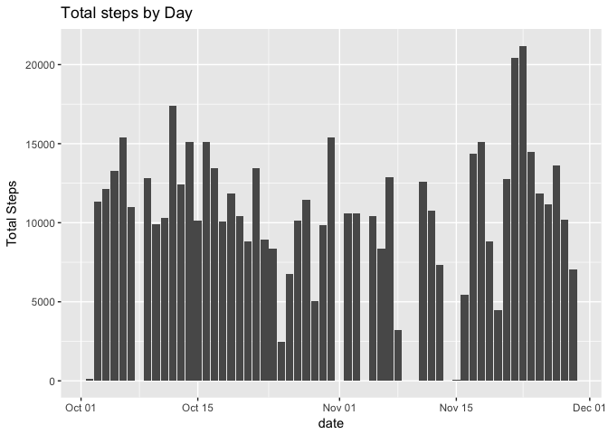
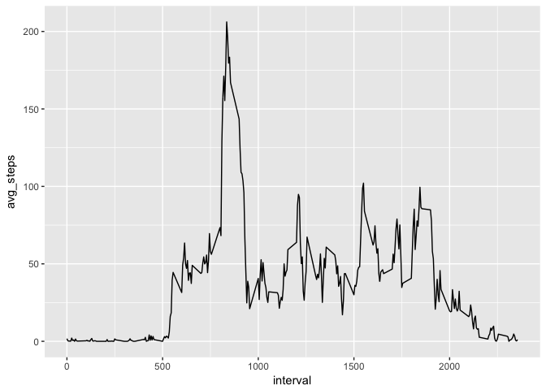
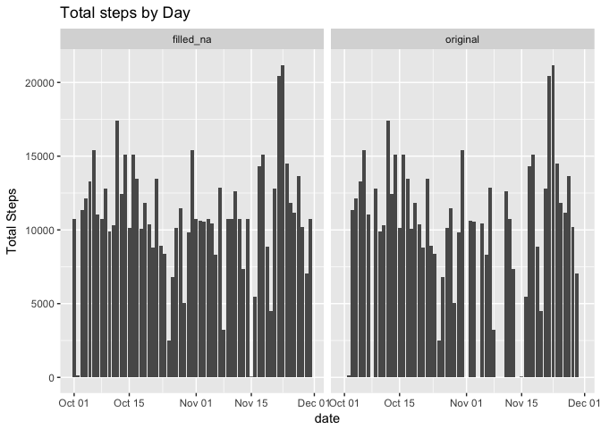
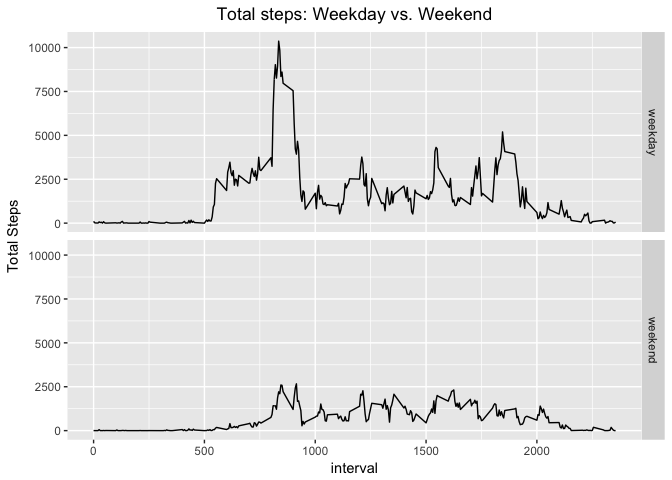

# Reproducible Research: Peer Assessment 1


## Loading and preprocessing the data

The input file `activity.csv` contains three variables :

- __date__ : Date the observation was collected
- __interval__ : A number denoting 5 min interval for the observation 
- __steps__ : Steps taken during that interval.

Since we have a date field with a `%Y-%m-%d` format, we'll create a custom class and use that when reading the file.


```r
setClass('myDate')
setAs("character","myDate", function(from) as.Date(from, format="%Y-%m-%d") )
```

We'll read the CSV file and store it in `thedata` object. 


```r
thedata <- read.csv(unz("activity.zip","activity.csv"),na.strings = c("NA"),colClasses = c("numeric","myDate","factor"))
```

__Note__: Ensuring that NA strings are treated as R NA values by using `na.strings=c("NA")`

## What is mean total number of steps taken per day?

In order to get the mean for total steps, we'll first have to aggregate the results by `date` and then plot the aggregated data. We'll use the `dplyr` package to 
group and aggregate the data into a new data frame `steps_by_day`


```r
library(dplyr)
steps_by_day <- thedata %>% group_by(date) %>% summarise(total_steps = sum(steps),avg_steps = mean(steps,na.rm=TRUE))
steps_by_day$source <- "original"
```

__Note__ : We use `na.rm=TRUE` to skip `NA` values when calculating the mean. 

If we plot a simple histogram of hte total steps by each day, we'll see the below trend:


```
## Warning: Removed 8 rows containing missing values (position_stack).
```

<!-- -->

__Note__ : You'll notice the `## Warning` telling us about `NA` values. We'll look at this later in this document. Let's look at a summary of the `steps_by_day`


```
##       date             total_steps      avg_steps          source         
##  Min.   :2012-10-01   Min.   :   41   Min.   : 0.1424   Length:61         
##  1st Qu.:2012-10-16   1st Qu.: 8841   1st Qu.:30.6979   Class :character  
##  Median :2012-10-31   Median :10765   Median :37.3785   Mode  :character  
##  Mean   :2012-10-31   Mean   :10766   Mean   :37.3826                     
##  3rd Qu.:2012-11-15   3rd Qu.:13294   3rd Qu.:46.1597                     
##  Max.   :2012-11-30   Max.   :21194   Max.   :73.5903                     
##                       NA's   :8       NA's   :8
```

From the above table we can see the mean of the Total steps per day is :


```
## [1] 10766.19
```

__Note__ : We use `na.rm=TRUE` to skip `NA` values when calculating the mean. 

## What is the average daily activity pattern?

Now let's look at this data but across the various days but by the `interval`. First let's aggregate the data by the `interval`.


```r
library(dplyr)
avg_by_interval <- thedata %>% group_by(interval) %>% summarise(avg_steps = mean(steps,na.rm=TRUE))
avg_by_interval$interval <- as.numeric(as.character(avg_by_interval$interval))
avg_by_interval <- avg_by_interval %>% arrange(interval)
```

__Note__ : We use `na.rm=TRUE` to skip `NA` values when calculating the mean.  We've also converted the `interval` variable to a numeric value so that we can order. This will allow the line graph to present it in increasing internval numbers.

If we do a time series of the average steps by the various intervals,it would look like this:

<!-- -->

The time interval that has the most number of steps:


```r
avg_by_interval[which.max(avg_by_interval$avg_steps),]$interval
```

```
## [1] 835
```

## Imputing missing values

As you saw we've been ignoring the `NA` values for the aggregates and plots. We would like to fill up these `NA` values with valid values so that we don't have to skip those rows. For this document we are going to replace NA values with the average steps for all days for the corresponding interval. The below code snippet will update the `NA` values with the interval averages. We'll create a new data set called `thedata_no_na` that has these values replaced.


```r
thedata_no_na <-thedata 
thedata_no_na$steps <- with(thedata_no_na,ifelse(is.na(steps),filter(avg_by_interval,interval == interval)$avg_steps,steps))
```

Now let's see of the averages steps per day of the new data set has changed when we include those rows that previously had `NA`. We'll combine the two aggregations into a `merged` dat aset. 


```r
library(dplyr)
steps_by_day_2 <- thedata_no_na %>% group_by(date) %>% summarise(total_steps = sum(steps),avg_steps = mean(steps))
steps_by_day_2$source <- "filled_na"

merged <- rbind(steps_by_day,steps_by_day_2)
```

Now let's compare the histograms of with and without na values replaced.


```
## Warning: Removed 8 rows containing missing values (position_stack).
```

<!-- -->

 For completeness let's look at the mean of the original and new aggregations


```
## [1] 10766.19
```

```
## [1] 10766.19
```

As you can see because we used the mean of steps for that interval, the overall pattern did not significantly change and mean was identical. If we used a different strategy to fill `NA` values the results would have been different.

## Are there differences in activity patterns between weekdays and weekends?

Now let's look at the average of steps by the time interval and analyze if there's any difference between weekdays and weekends. To start we are going to include a variable that will determine if the `date` on the observation is a weekday or weekend. We'll add 2 variables: `day_of_week` and `wday_or_weekend` as follows:


```r
thedata_no_na$day_of_week <- weekdays(thedata_no_na$date,abbreviate=TRUE)
thedata_no_na$wday_or_weekend <- ifelse(thedata_no_na$day_of_week == "Sun" | thedata_no_na$day_of_week == "Sat","weekend","weekday")
```

Now as earlier we'll aggregate the data by `interval` and the `wday_or_weekend` variables. We'll also make sure the `interval` variable is a numeric value so that we can use that in subsequent charts.


```r
library(dplyr)
steps_by_day_type <- thedata_no_na %>% group_by(interval,wday_or_weekend) %>% summarise(total_steps = sum(steps),avg_steps = mean(steps))
steps_by_day_type$interval <- as.numeric(as.character(steps_by_day_type$interval))
```

Now let's do a side by side comparison of average of steps for weekdays and weekends.

<!-- -->
